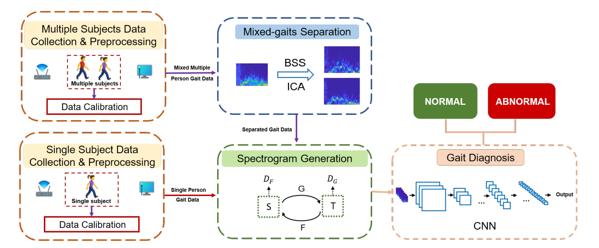

# Wi-Diag: 基于商用Wi-Fi的多目标异常步态诊断系统

[](https://www.python.org/downloads/)
[](https://pytorch.org/)
[](LICENSE)
[](https://doi.org/10.1109/JIOT.2023.3301908)

<div align="center">
  
  <p><em>图1: Wi-Diag系统整体架构</em></p>
</div>

## 📖 目录

- [项目简介](#-项目简介)
- [核心创新](#-核心创新)
- [系统架构](#-系统架构)
- [环境要求](#-环境要求)
- [快速开始](#-快速开始)
- [数据采集](#-数据采集)
- [模型训练](#-模型训练)
- [实验结果](#-实验结果)
- [代码结构](#-代码结构)
- [复现指南](#-复现指南)
- [常见问题](#-常见问题)
- [引用](#-引用)
- [许可证](#-许可证)

## 🎯 项目简介

**Wi-Diag** 是首个基于商用Wi-Fi设备实现**多目标同时异常步态诊断**的系统。只需要一对普通的Wi-Fi收发器（一发一收，接收端3天线），就能在多人同时行走的场景下，准确分离每个人的步态信息并进行异常诊断。

### 背景与挑战

- **临床需求**：步态异常是帕金森病等多种神经系统疾病的早期信号，但传统诊断依赖医生一对一观察，工作量大
- **技术挑战**：
  - 多人同时行走时，Wi-Fi信号相互混叠，难以分离
  - Wi-Fi信号易受环境变化影响，模型泛化能力差

### 核心贡献

1. **理论创新**：证明多人步态分离可建模为盲源分离(BSS)问题，验证ICA的三个适用条件
2. **技术创新**：ICA分离 + CycleGAN环境适配的创新组合
3. **应用突破**：首个实现商用Wi-Fi多人步态诊断的系统

## 🚀 核心创新

### 1. 盲源分离(BSS)框架

将多人步态信号混合建模为：
```
x(t) = A·s(t) + n
```
其中：
- `x(t)`: 接收到的混合信号
- `s(t)`: 每个人的步态源信号
- `A`: 混合矩阵
- `n`: 噪声

### 2. ICA分离算法

通过验证三个关键条件，采用RobustICA进行信号分离：
- ✅ **独立性**：不同人行走动作相关性 < 0.05
- ✅ **非高斯性**：CSI幅值分布明显非高斯
- ✅ **线性混合**：多天线接收信号是线性组合

### 3. CycleGAN环境适配

解决模型的环境依赖问题，实现跨场景泛化：
- 源域：多人分离出的步态频谱图
- 目标域：单目标的标准步态频谱图
- 无配对图像转换，保持步态特征不变

## 🏗 系统架构

```
数据采集预处理 → 混合步态分离 → 频谱图生成 → 步态诊断
       ↓              ↓              ↓            ↓
  带通滤波        ICA算法        STFT变换      CNN分类器
  PCA降维        RobustICA      频谱增强      (正常/异常)
  行走检测                        CycleGAN
```

## 💻 环境要求

### 硬件要求
- **CPU**: 4核以上 (推荐8核)
- **RAM**: 16GB以上
- **GPU**: NVIDIA GPU with 8GB+ VRAM (推荐RTX 3070以上)
- **Wi-Fi设备**: Intel 5300网卡 + 3天线

### 软件要求
- **操作系统**: Ubuntu 18.04/20.04 (推荐) 或 Windows 10/11
- **Python**: 3.8 或更高版本
- **CUDA**: 11.0 或更高 (GPU训练需要)

### 依赖包
```bash
pip install -r requirements.txt
```

主要依赖：
- numpy==1.21.0
- scipy==1.7.0
- scikit-learn==0.24.2
- torch==1.9.0
- torchvision==0.10.0
- matplotlib==3.4.2
- seaborn==0.11.1
- opencv-python==4.5.3.56
- tqdm==4.61.0

## 🚀 快速开始

### 1. 克隆项目
```bash
git clone https://github.com/cydd-1972/wi-diag.git
cd wi-diag
```

### 2. 安装依赖
```bash
pip install -r requirements.txt
```

### 3. 运行演示（使用合成数据）
```bash
# 2人同时行走诊断演示
python main.py --mode demo --n_subjects 2

# 4人同时行走诊断演示
python main.py --mode demo --n_subjects 4
```

### 4. 查看结果
运行后会生成：
- 行走检测结果图
- ICA分离效果图
- 频谱图可视化
- 诊断准确率报告
- ROC曲线

## 📊 数据采集


### 采集参数

| 参数 | 设置 |
|------|------|
| 载波频率 | 5.825 GHz (Channel 161) |
| 采样率 | 1000 Hz |
| 发射功率 | 15 dBm |
| 收发距离 | 4 m (最佳) |
| 行走距离 | 5 m |
| 行走时间 | 5 s (最佳) |

### 步态类型

| 类型 | 描述 |
|------|------|
| 正常步态 | 自然行走 |
| 痉挛步态 | 拖脚步行，下肢伸展 |
| 剪刀步态 | 双腿内收交叉 |
| 跨阈步态 | 足下垂，足尖拖地 |
| 摇摆步态 | 摇摆步态，身体侧移 |
| 前冲步态 | 头颈前倾，躯干僵硬 |
| 帕金森步态 | 小碎步，前倾姿势 |

### 数据格式

CSI数据以HDF5格式存储：
```python
import h5py
with h5py.File('data/sample.h5', 'r') as f:
    csi_data = f['csi'][:]  # shape: [时间, 天线对, 子载波]
    labels = f['labels'][:]  # 标签: 0=正常, 1=异常
```

## 🎓 模型训练

### 1. 训练单目标诊断模型
```bash
python main.py --mode train_single --data_dir ./data/single_subject/
```

### 2. 训练CycleGAN进行域适配
```bash
python main.py --mode train_cyclegan \
    --source_dir ./data/multi_subject/ \
    --target_dir ./data/single_subject/
```

### 3. 训练完整系统
```bash
python main.py --mode train_full \
    --single_data ./data/single_subject/ \
    --multi_data ./data/multi_subject/
```

### 4. 测试多人诊断
```bash
python main.py --mode test_multi \
    --test_data ./data/test/ \
    --n_subjects 3
```

## 📈 实验结果

### 整体性能

| 场景 | 诊断准确率 |
|------|-----------|
| 空大厅 | 91.20% |
| 办公室 | 86.42% |
| 实验室 | 85.69% |
| **平均** | **87.77%** |

### 消融实验

| 配置 | 空大厅 | 办公室 | 实验室 |
|------|--------|--------|--------|
| 无ICA | 52.32% | 48.36% | 50.15% |
| 无CycleGAN | 87.52% | 68.13% | 67.32% |
| ICA+CycleGAN | **91.20%** | **86.42%** | **85.69%** |

### 参数影响


- **最佳收发距离**: 4 m
- **最佳行走时间**: 5 s
- **最大有效区域**: 6 m × 6 m
- **行走速度影响**: 不显著

## 📁 代码结构

```
wi-diag/
├── README.md                 # 项目说明
├── requirements.txt          # 依赖包
├── config.py                 # 配置文件
├── main.py                   # 主程序
├── data_loader.py           # 数据加载
├── preprocessing.py         # 预处理模块
├── separation.py            # ICA分离模块
├── spectrogram.py           # 频谱图生成
├── cyclegan.py              # CycleGAN实现
├── cnn_classifier.py        # CNN分类器
├── utils.py                 # 工具函数
├── data/                    # 数据目录
│   ├── raw/                 # 原始CSI数据
│   ├── processed/           # 预处理后数据
│   └── spectrograms/        # 生成的频谱图
├── models/                  # 模型保存
│   ├── single_subject_cnn.pth
│   ├── cyclegan_final.pth
│   └── full_system.pth
├── docs/                    # 文档
│   └── figures/             # 论文图表
└── experiments/             # 实验脚本
    ├── ablation.py          # 消融实验
    ├── parameter_sweep.py   # 参数扫描
    └── comparison.py        # 对比实验
```

## 🔧 复现指南

### 步骤1: 数据准备

1. **采集CSI数据**（使用Intel 5300网卡）：
```bash
# 使用Linux 802.11n CSI Tool
sudo ./log_to_file ./data/raw/experiment_1.dat
```

2. **转换为HDF5格式**：
```python
python utils/convert_to_h5.py --input ./data/raw/ --output ./data/processed/
```

### 步骤2: 预处理
```python
from preprocessing import CSIPreprocessor
preprocessor = CSIPreprocessor(config)
processed_data, segments = preprocessor.preprocess_pipeline(csi_data)
```

### 步骤3: ICA分离
```python
from separation import GaitSeparator
separator = GaitSeparator(config)
separated_signals = separator.separate_gaits(processed_data, n_subjects=2)
```

### 步骤4: 生成频谱图
```python
from spectrogram import SpectrogramGenerator
spec_gen = SpectrogramGenerator(config)
spectrograms = spec_gen.generate_multi_subject_spectrograms(separated_signals)
```

### 步骤5: CycleGAN域适配
```python
from cyclegan import CycleGAN, SpectrogramDataset
cyclegan = CycleGAN(config)
cyclegan.train(dataloader_S, dataloader_T)
transformed = cyclegan.transform(source_spectrograms)
```

### 步骤6: 诊断分类
```python
from cnn_classifier import GaitDiagnosisModel
classifier = GaitDiagnosisModel(config)
predictions, probabilities = classifier.predict(transformed)
```

### 步骤7: 评估
```python
from utils import calculate_metrics, plot_confusion_matrix
metrics = calculate_metrics(y_true, y_pred)
plot_confusion_matrix(y_true, y_pred)
```

## ❓ 常见问题

### Q1: 没有Intel 5300网卡，如何获取CSI数据？
- 可以使用项目提供的合成数据生成函数：`data_loader.generate_synthetic_csi()`
- 或使用其他Wi-Fi嗅探工具（如ESP32-S3）采集原始信号

### Q2: ICA分离需要预先知道人数，如何解决？
- 当前版本需要手动指定人数
- 未来版本将集成人数检测模块（如Wi-Count）

### Q3: CycleGAN训练需要多少数据？
- 论文中使用：源域513张、目标域452张频谱图
- 可以通过数据增强扩充数据集

### Q4: 多人行走是否必须同时起步？
- 是的，目前系统要求多人同时起步
- 这是实验控制的必要条件

### Q5: 如何提高跨场景泛化能力？
- 采集更多场景的训练数据
- 调整CycleGAN的λ参数
- 尝试其他域适配方法（如CORAL、MMD）


## 🤝 贡献指南

欢迎贡献代码、提出问题或建议！

1. Fork 项目
2. 创建特性分支 (`git checkout -b feature/AmazingFeature`)
3. 提交更改 (`git commit -m 'Add some AmazingFeature'`)
4. 推送到分支 (`git push origin feature/AmazingFeature`)
5. 提交 Pull Request
